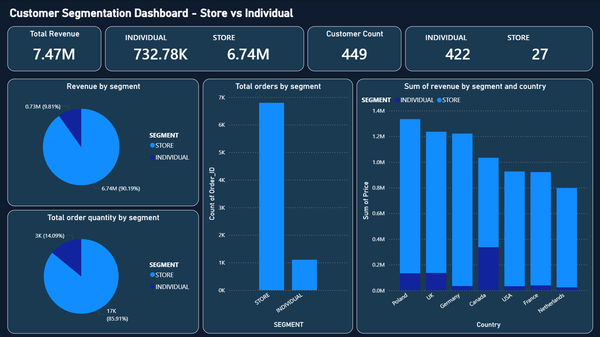

# Ecommerce-Data-Analysis

## Project Overview
In this project I analyse the ecommerce data to find out who are the clients, to help develop a marketing strategy to target the type of clients who bring us the most revenue.

The analysis answers:
- Who are our customers?
- Which segments generate most revenue?
- What are geographic patterns per segment?

## Business Question
**"Who are our customers? Around who we should build our promotion strategy?"**

## Key Findings
- Most of our clients are individual clients(422 individual clients vs 27 store clients)
- Store clients drive revenue despite being only 6% of customer base (90% of revenue)
- Poland is our top revenue market among all countries

## Recommendations
Stores are our channel to scale up the sales, marketing strategy should be focused mainly on this type of customer if we want to scale up fast.
Marketing strategy should focus on retail partnerships/wholesale segment.

## Recommendation for Future Analysis
- Product Analysis, which products drive highest revenue.
- Customer identification, which stores bring us the most revenue.

## Tech Stack
- Python/JupyterNotebook
- PowerBI
